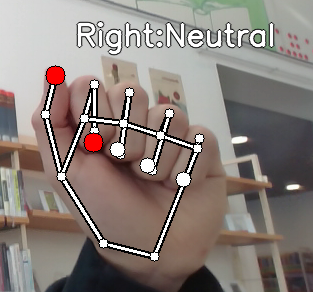
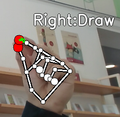
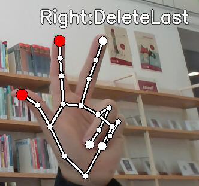
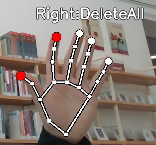

# VIDEODRAW

## Dependencies
- python3
- pip
- install requirements.txt via pip (pip install -r requirements.txt)

## How to start
- To run app, python3 interface/app.py
- in general, every executable needs to be executed from root

## Interface
Drawing Interface for User with 4 possible hand gestures:
1. Neutral 

Neutral gesture which doesnt affect Drawing
2. Draw

Gesture for drawing, draws at the position of the index finger
3. DeleteLast

Deletes last annotation of Drawing
4. DeleteAll

Deletes whole Drawing

## Custom Aliases for frequent use
alias cdvdraw='cd {your_path_to_videodraw}'
alias activate='source venv/bin/activate'
alias vdraw='python interface/app.py'
alias vdrawinit='cdvdraw activate vdraw'

