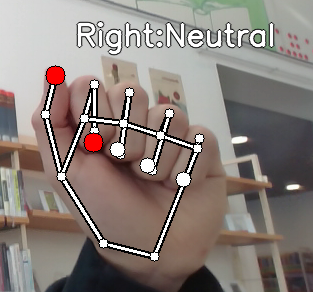
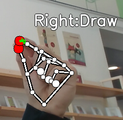
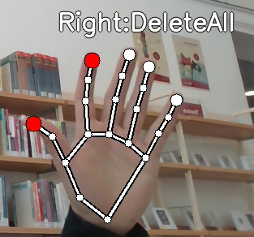

# VIDEODRAW

## Dependencies
- python3
- pip
- install requirements.txt via pip (pip install -r requirements.txt)

## How to start
- To run app, python3 interface/app.py
- in general, every executable needs to be executed from root

## Interface
The Hand recognition Model is based on Kazuhito Takahashis Model https://github.com/Kazuhito00/hand-gesture-recognition-using-mediapipe.git and was modified.  
Drawing Interface for User with 4 possible hand gestures:

1. Neutral  
  
Neutral gesture which doesnt affect Drawing  

2. Draw  
  
Gesture for drawing, draws at the position of the index finger  

3. DeleteLast  
  
Deletes last annotation of Drawing  

4. DeleteAll  
  
Deletes whole Drawing  

## Custom Aliases for frequent use
alias cdvdraw='cd {your_path_to_videodraw}'  
alias activate='source venv/bin/activate'  
alias vdraw='python interface/app.py'  
alias vdrawinit='cdvdraw activate vdraw'  

